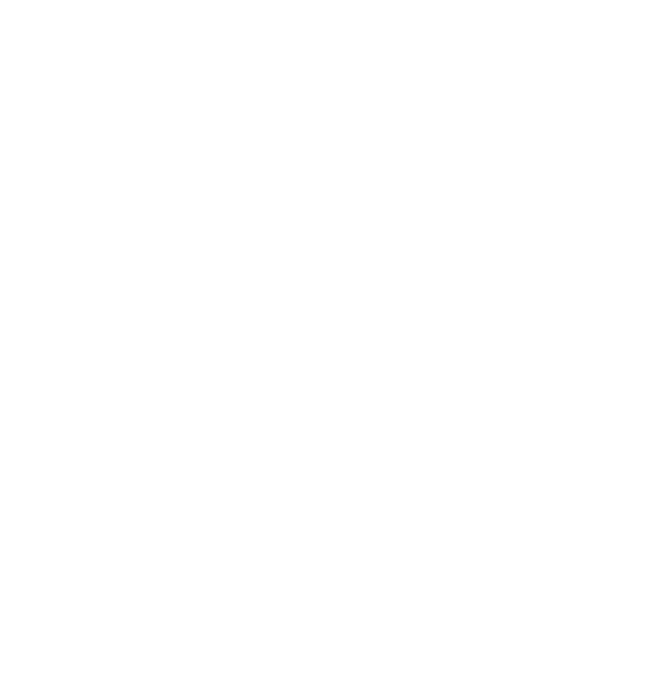

# Stefan Bürk - Who is this guy ?

<!-- column_layout: [2, 1] -->

<!-- column: 1 -->

<!-- column: 0 -->

* Working at `web-vision GmbH` since 2023-07-01
<!-- pause -->
  * as `TYPO3 Core Developer (80%)` thanks to web-vision for that
  * as `Senior Backend Developer (20%)` to support in projects and extensions, core bugs, ...
<!-- pause -->
* working since 2008 with TYPO3
* actively contributing to the TYPO3 Core and ecosystem since August 2021
<!-- pause --> 
* TYPO3 Core Framework Merger since 2022
  * TYPO3 Core
  * TYPO3 testing-framework
  * core-testing images / Core CI
  * ...

<!-- pause -->

### Contact

| Channel                 | -                                                      |
|-------------------------|--------------------------------------------------------|
| on Github               | [https://github.com/sbuerk](https://github.com/sbuerk) |
| TYPO3 Slack handle      | @stefan.buerk                                          |
| TYPO3 Slack Channel(s)  | #typo3-cms #typo3-cms-coredev #cig-testing             |
| X a.k.a. Twitter handle | @stefanbuerk                                           |

<!-- end_slide -->

# What is the `typo3/testing-framework` ?

<!-- pause -->

---

## The `typo3/testing-framework` ... 
<!-- pause -->
**is a composer package providing additions to integrate `unit`, `functional` and `acceptance testing` ...**
<!-- pause -->
* for the TYPO3 core development
<!-- pause -->
* for TYPO3 extension development
<!-- pause -->
* for TYPO3 projects development
<!-- pause -->
based on `phpunit/phpunit` (and `codeception`)

<!-- pause -->

---

## Version support overview

| testing-framework | TYPO3           | PHP                               | PHPUnit  |
|-------------------|-----------------|-----------------------------------|----------|
| 8.x.x             | v12, v13 (main) | 8.1, 8.2, 8.3 (8.4)               | ^10, ^11 |
| 7.x.x             | v11, v12        | 7.4, 8.0, 8.1, 8.2, 8.3 (8.4)     | ^9, ^10  |
| 6.x.x             | v10, v11        | 7.2, 7.3, 7.4, 8.0, 8.1, 8.2, 8.3 | ^8, ^9   |
<!-- pause -->
> TF <= 6.x no longer maintained
<!-- pause -->
> TF 7.x provides unit and functional configuration for PHPUnit 9 and 10 as templates 

<!-- end_slide -->

# Difference between `unit` and `functional` tests

<!-- pause -->
* `unit tests` tests classes in a isolated manner, not having a working application (TYPO3 instance) available
<!-- pause -->
  * no working `Dependency Injection container (DI)` of extensions or core
  * no database or any loaded extensions
  * API's like DataHanlder and so on does not work out of the box
  * basically working in context of the root folder, so be carefully with real file/folder operations !
  * root composer autoload is used and package information reused for some compat, when `UnitTestCase` of the
    `testing-framework` is used
<!-- pause -->

> That means you need to mock or instanciate dependencies on your own, that counts for all related
> services like databases, cache systems, external API's or services (for example a solr instance ).

<!-- pause --> 

* for `functional tests` the `testing-framework` will create a fully working TYPO3 instance for the `FunctionalTestCase`
  * in a temporary folder `<public-web-folder/typo3temp/var/tests/functional-*`
<!-- pause --> 
  * based on selected `system extensions` beside the default system extensions => `$coreExtensionsToLoad = [];`
<!-- pause --> 
  * based on selected `test extensions` => `$testExtensionsToLoad = [];`
    * fixture extensions are possible which are not required to be published dedicatly nor loaded in real instances
<!-- pause --> 
  * database structure (tables) are created based on loaded extensions
  * after each test or test-permutation (dataProvider) the database content is reset/cleared
    * that allows to import/provide different data in the database per test or test data-set
<!-- pause --> 
  * each `test instance` is a `non-composer (legacy) mode` installation
<!-- pause --> 
  * DI is fully working
<!-- pause --> 
  * extension registering `hooks`, listening for `PSR-14 events` or dispatching them can be tested in    
  * `FunctionalTestCase` provides additional property and tools to load fixture data (CSV) or files/paths into the
     created test-instance
<!-- pause --> 
  * can be executed against all supported database backends
<!-- pause --> 
  * additional services (redis, memcache) can speak with real services (needs to be provided and configured)

<!-- pause -->
> DISCLAIMER: We are already working on `composer mode` based functional test instance creation.

<!-- end_slide -->

# Differences between `project` and `extension` testing

* **Projects** usually needs to support only one PHP version, Database vendor and version and TYPO3 core version
<!-- pause --> 
  * version raises for upgrades are usually prepared on a branch and changed instead of parallel execution
<!-- pause --> 
* **Extensions**, special **shared** or **public** extensions, usually supports multiple **TYPO3 core version** and thus PHP versions
<!-- pause --> 
  * for extension different version models are usus
    * one extension version <-> one TYPO3 Core version
    * one extension version <-> multiple TYPO3 Core versions
      * **typo3/testing-framework** supports only two core version per TF version
<!-- pause -->
* Project may have different places for tests
  * local path extension tests `packages/*/Tests/*`
  * global (root) tests `Tests/*`
<!-- pause -->
* Extension usually have only `Tests/*` root folder tests

<!-- pause -->
> Core mono repo is basically a project setup, having local path extensions in `typo3/sysexts/*`
> instead of the more known and lived `packages/*` project folder structure.

<!-- pause -->

# The up and downs with configurable systems

<!-- pause -->
`phpunit` provides the ability to execute tests from different places and folders and other shenigans, like using
groups for tests and for execution calls to skip tests for specific groups. This is a benefit on the one side, on
the other side this makes it hard to document or provide things in a real flexible way.

<!-- pause -->
With this background, some usually structures how and where to provide tests have evolved in different ecosystems
and also in our lovely TYPO3 universe and community.

<!-- pause -->
> During the demo we will play with different scenarios especial for `project` testing and how you can adopt for your
> folder structure and needs.

<!-- end_slide -->

# Neogitation - what are the different level of integration ?

## That is literally a very good question.

<!-- pause -->

### Basic integration

<!-- pause -->

* Integrate required tools (packages/dependencies)
* Provide basic configuration
* Basically execute tests (unit/functional) in a simple form (using ddev as local development environment)

<!-- pause -->
> Plain, raw and direct. The hard work to provide the database and how to make that easy for your team or
> contributors is still up to you ! But with this knowledge you know what is the bare minimum needed to
> execute tests !

<!-- pause -->
* In the demo we will ...
<!-- pause --> 
  * do the basic integration for a `project`
<!-- pause --> 
  * do the basic integration for a `extension` (single core version)

<!-- pause -->

#### Required steps for basic integration

<!-- pause -->
* add dependencies (testing-framework and phpunit)
<!-- pause --> 
* provide configuration files for unit and functional tests
<!-- pause --> 
* execute the tests within the ddev environment
<!-- pause -->

### The UX of test integration 

<!-- pause -->
> We will come to that point at a later point.
 
<!-- end_slide -->

# Wooho theory ...

<!-- pause -->

<!-- column_layout: [2, 1, 2] -->

<!-- column: 1 -->

**DEMO TIME**

<!-- pause -->
<!-- pause -->

<!-- end_slide -->

# Are you still alive ?

**Thanks for your time listening.**

<!-- pause -->

## Q/A

**Any questions ?**

## Resources

| Label                               | URL                                                                                                                            |
|-------------------------------------|--------------------------------------------------------------------------------------------------------------------------------|
| Slides repository                   | [https://github.com/sbuerk/tf-basics-usergroup-bodensee-slides](https://github.com/sbuerk/tf-basics-usergroup-bodensee-slides) |
| TF Basics Demo Project Repository   | [https://github.com/sbuerk/tf-basics-project](https://github.com/sbuerk/tf-basics-project)                                     |
| TF Basics Demo Extension Repository | [https://github.com/sbuerk/tf-basics-extension](https://github.com/sbuerk/tf-basics-extension)                                 |

## Contact

| Channel                 |                                            |
|-------------------------|--------------------------------------------|
| TYPO3 Slack handle      | @stefan.buerk                              |
| TYPO3 Slack Channel(s)  | #typo3-cms #typo3-cms-coredev #cig-testing |
| X a.k.a. Twitter handle | @stefanbuerk                               |

The slides are presented using [presenterm](https://github.com/mfontanini/presenterm) with the `kitty terminal`.